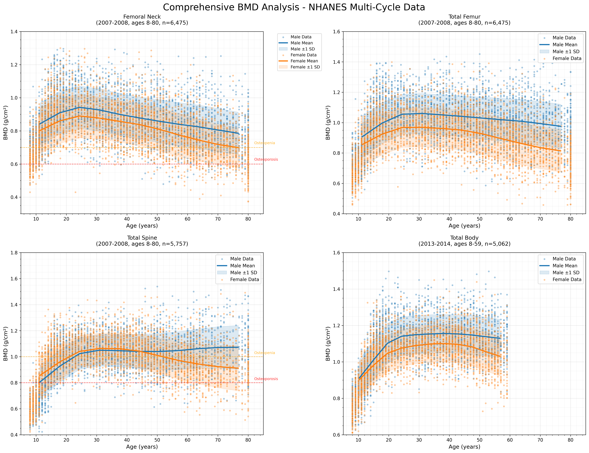
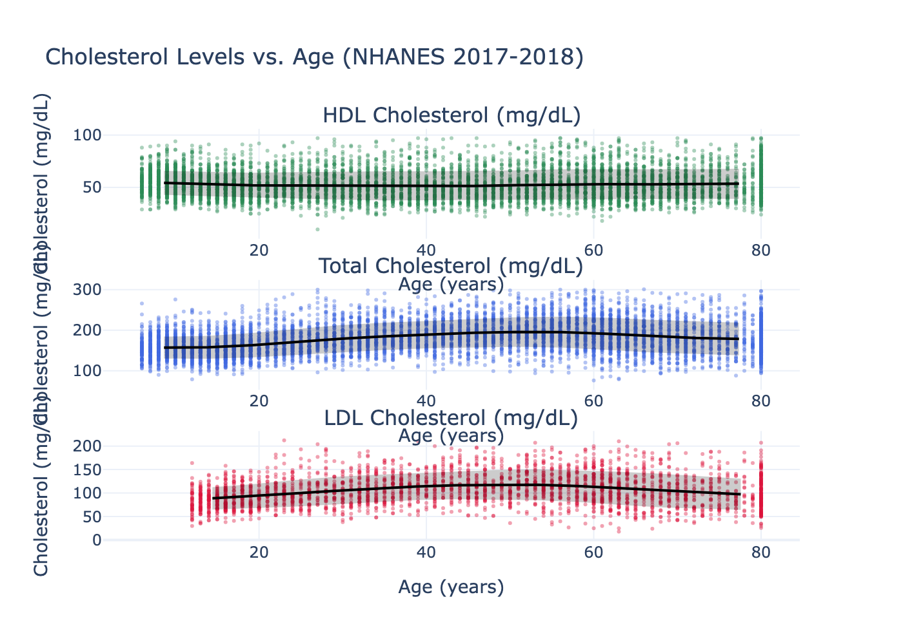
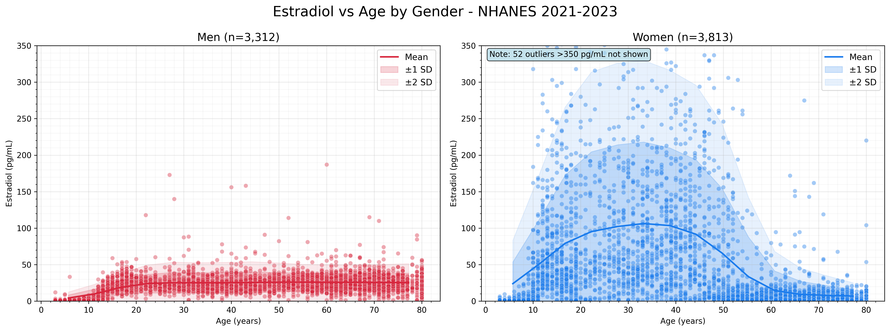
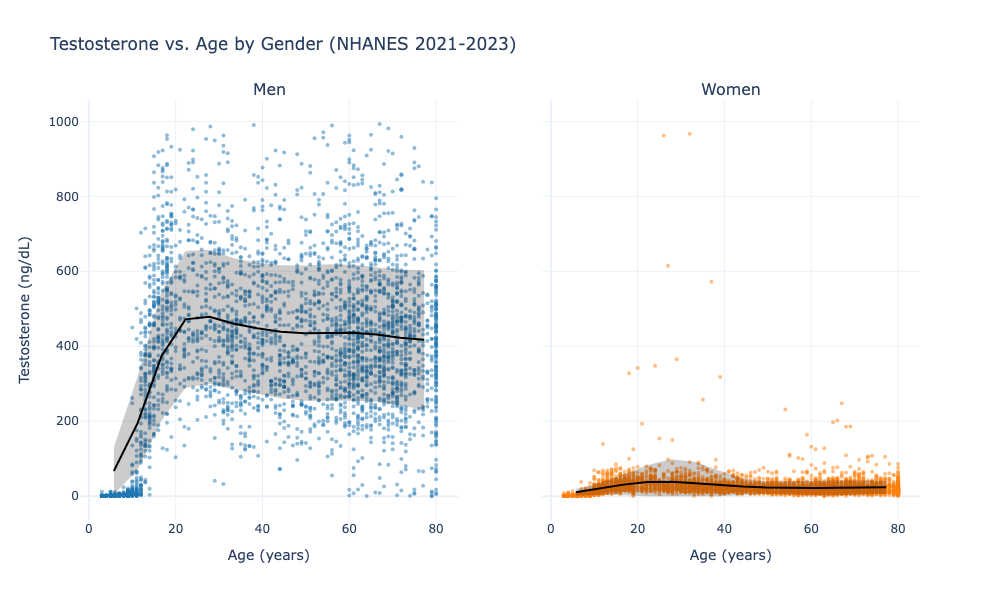
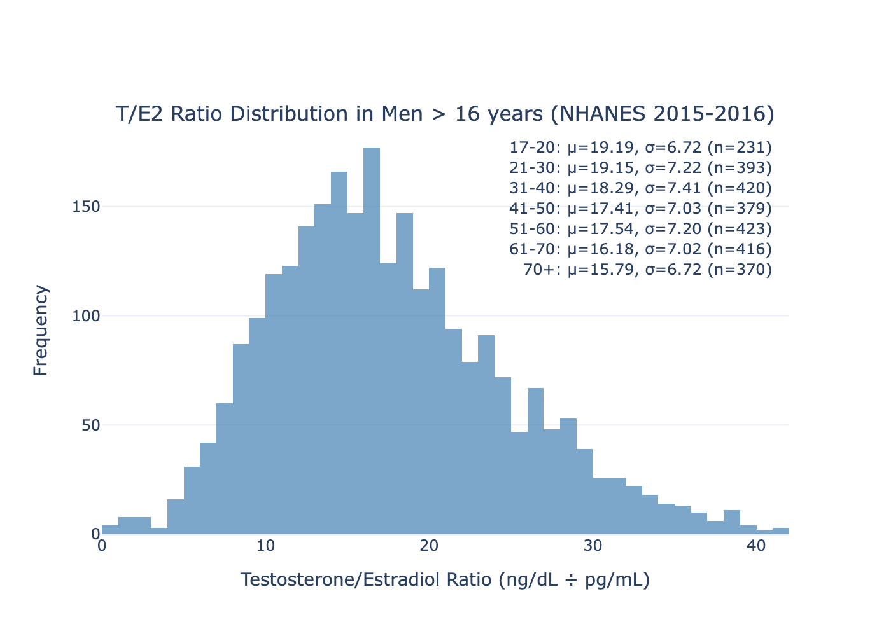

# Pandas-Nhanes

A Python package for accessing a cleaned subset of NHANES 
*National Health and Nutrition Examination Survey* data for quick prototyping—no API key required.

Caching is implemented to avoid re-downloading datasets.

# Todo
- include demographics data automatically in df

## Installation

Install from PyPI:

```bash
pip install pandas_nhanes
```

Or from source:

```bash
git clone https://github.com/jeromevde/pandas_nhanes.git
cd pandas_nhanes
pip install -e .
```

## Usage

```python
from pandas_nhanes import get_variables, get_dataset, explore
```
```python
# Get the full NHANES variable table
variables = get_variables()
```

```python
# Explore the variables table in an interactive HTML table in browser
explore()
```

Rerun all examples in the examples folder:

```bash 
for script in Examples/*.py; do echo "Running $script..."; python "$script"; echo "Completed $script"; echo ""; done
```     

### Online Variables Explorer

You can also explore the NHANES variables online at: https://jeromevde.github.io/Pandas-Nhanes


```python
# Download a dataset as a pandas DataFrame
TST_L = get_dataset("TST_L")
```

## Results

### BMD Hybrid Complete


### BMD Age Gender Complete


### BMD Age Gender All Ages


### BMD Age Gender


### Cholesterol Age


### Estradiol Age Gender


### Testosterone Age Gender


### Testosterone Estrogen Ratio
